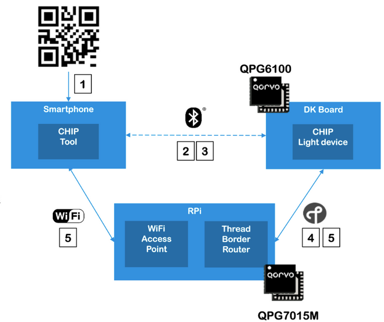
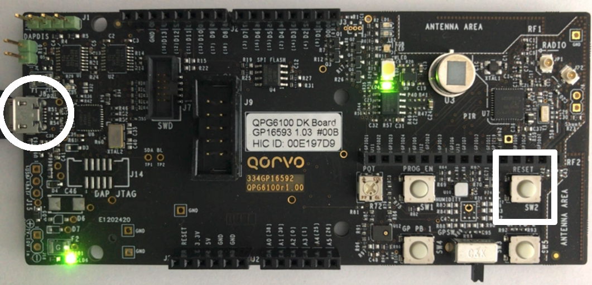
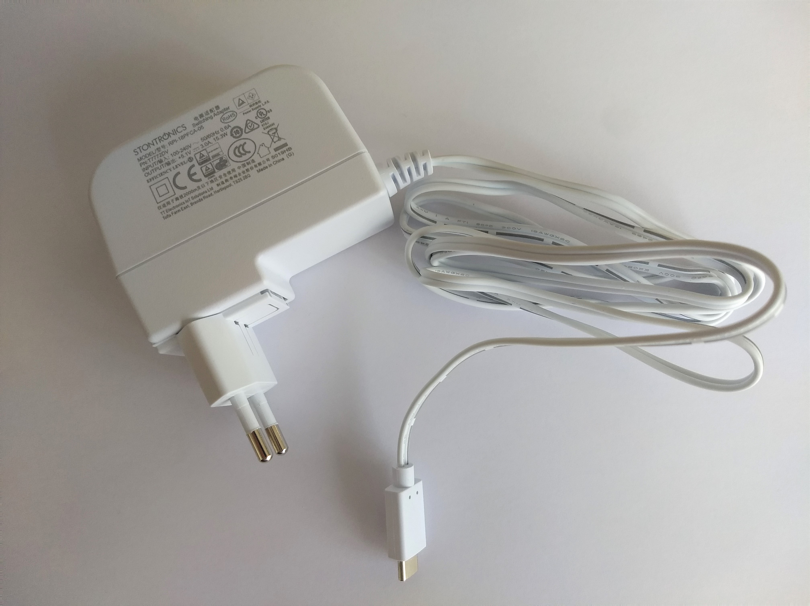
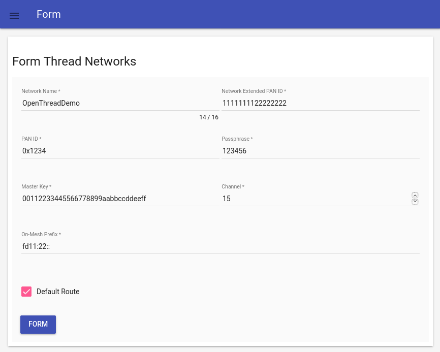
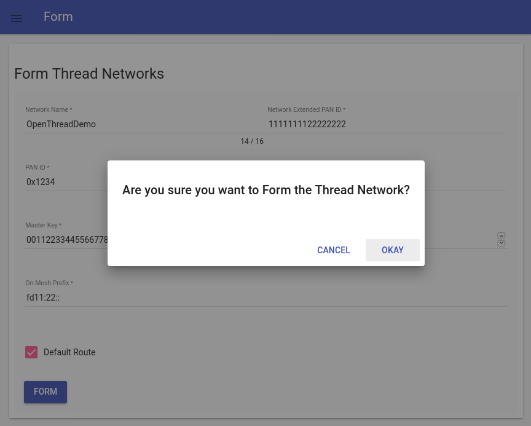
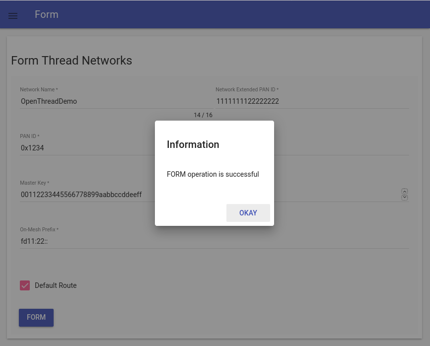
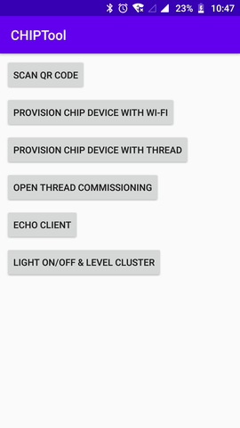
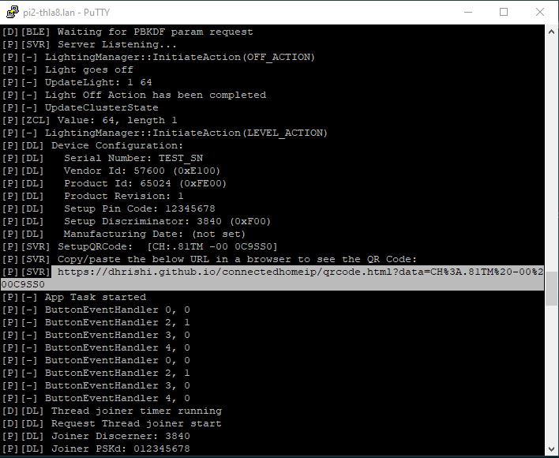
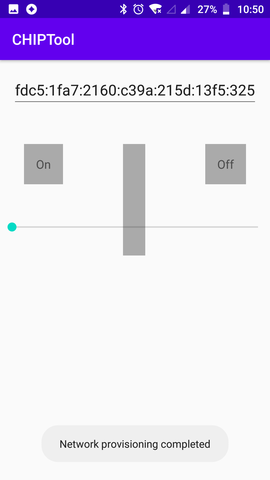

# Quickstart Guide Qorvo CHIP Evaluation Kit

# Table of Contents
* [Overview](#overview)
* [QPG6100 DK board setup](#qpg6100-dk-board-setup)
* [QPG7015M Border Router setup](#qpg7015m-border-router-setup)
	* [Connect Android mobile device to the Wi-Fi access point](#connect-android-mobile-device-to-the-wi-fi-access-point)
	* [Form a new Thread network](#form-a-new-thread-network)
* [Install the Android CHIPTool application](#install-the-android-chiptool-application)
* [Provision the QPG6100 DK board using CHIPTool](#provision-the-qpg6100-dk-board-using-chiptool)
	* [Open CHIPTool on the Android smartphone.](#open-chiptool-on-the-android-smartphone.)
	* [Retrieve the QR code URL](#retrieve-the-qr-code-url)
	* [Display the QR code](#display-the-qr-code)
	* [Scan the QR code](#scan-the-qr-code)
	* [Operate the light](#operate-the-light)
* [Shutting down the Raspberry Pi](#shutting-down-the-raspberry-pi)
* [Factory Reset](#factory-reset)
	* [QPG6100 DK board factory reset](#qpg6100-dk-board-factory-reset)
	* [QPG7015M development kit](#qpg7015m-development-kit)
* [Building from source](#building-from-source)
* [Important Notices](#important-notices)

## Overview

The CHIP Evaluation Kit contains the following hardware:

* Raspberry Pi 4 with QPG7015M daughter board add-on
* Micro SD card containing Linux OS, drivers and programmed with a Thread Border Router application
* Raspberry Pi USB-C power supply
* QPG6100 DK board, flashed with a CHIP Light application.
* QR code pointing to the quickstart guide

Additionally, an Android device to run the CHIPTool Smartphone Application is required.

This Evaluation kit will allow you to control a CHIP Light device implemented
on the QPG6100 DK board using a WiFi connected Android device via the QPG7015M
DK that implements a Thread Border Router:

1. The smartphone scans the Light device's QR code
2. A secure Bluetooth Low Energy connection is setup using the QR code information
3. Thread network credentials are passed to the QPG6100 Light device
4. The CHIP Light device joins the Thread network
5. The smartphone can now communicate via IP over the QPG7015M based Wi-Fi-Thread router, the Light can be controlled by the smartphone

## QPG6100 DK board setup

Connect the QPG6100 DK board to a laptop.

To inspect the serial logging of the Light Application running on the QPG6100,
use a serial terminal such as [PuTTY](https://www.chiark.greenend.org.uk/~sgtatham/putty/latest.html).
To use PuTTY, enter the serial port your operating system assigned to the QPG6100 board and set the baudrate to 115200 (the default 8N1 parameters apply).

The serial logging will be needed later to commission the device.

## QPG7015M Border Router setup

* Ensure the included SD-Card is properly inserted
* Ensure the QPG7015M is **plugged in the orientation** [shown on the photo](./imgs/qpg7015m_power.png) onto the Raspberry Pi 4.
* Connect the included USB-C power supply directly to the Raspberry Pi 4 board.

Note: [Properly shut down the raspberry pi](#shutting-down-the-raspberry-pi) before turning off power to the device.

### Connect Android mobile device to the Wi-Fi access point
Connect your Android mobile device to the Raspberry Pi’s Wi-Fi access point. You can scan this QR code if your device supports it, otherwise, manually connect to the Wi-Fi network named “BorderRouter-AP” using the password `12345678`.

### Form a new Thread network

Visit the OT Border Router configuration page (only available when connected to the BorderRouter-AP) by navigating your Android web browser to http://192.168.2.2/ , or by scanning this QR code:

 ")

Navigate to ‘Form’ via the menu on the left.

Click the ‘FORM’ button.

Confirm that you want to form a network.

**&#8594; Verify that the “FORM operation is successful” pop-up appears.**

## Install the Android CHIPTool application

You can [download a CHIPTool application build from this GitHub repository](./apk/app-debug-arm64.apk), open it on an Android smartphone to install it.

As development is still ongoing on both tooling and application side, the version of the .apk and the application build need to be aligned.
The combination stored here is tested to work.

## Provision the QPG6100 DK board using CHIPTool

The QPG6100 DK provided with this kit ships ready to be commissioned. If you already commissioned the device, [perform a factory reset](#qpg6100-dk-board-factory-reset) first.

### Open CHIPTool on the Android smartphone.

### Retrieve the QR code URL

In the PuTTY application showing the serial output of the QPG6100 DK, locate and highlight the URL, the selected text will be copied into the copy/paste buffer.

### Display the QR code

Open a web browser and navigate to the URL.  The URL points to a website that generates the required QR code to commission the device with.

### Scan the QR code

In CHIPTool, tap “Provision CHIP device with Thread” and scan the QR code displayed in your web browser..

The network should appear, click "save network".

The message "provisioning completed" appears, and a slider and on/off controls are shown.

### Operate the light

You should now be able to operate the light application running on the QPG6100 DK board using the controls.

## Shutting down the Raspberry Pi

To avoid file corruption on the Raspberry Pi computer, you need to properly shut it down before disconnecting the power supply.

1. Connect your laptop to the BorderRouter-AP network (password `12345678`).
2. Use a SSH client (like PuTTY) to log in to the Raspberry Pi computer:
   - ip address `192.168.2.2`
   - username `pi`
   - password `raspberry`
3. issue the command `sudo halt`
4. The Raspberry Pi will disconnect the SSH session and shut down.

## Factory Reset

### QPG6100 DK board factory reset

You can hold the DK board's SW5 button for 10 seconds while it is powered to perform a factory reset.

The serial output will show:
`[P][DL] Performing factory reset`

After the board is reset it will start commissioning again.

### QPG7015M development kit

There is no way to reset the border router, but you can [form a new Thread network](#form-a-new-thread-network).

To reboot the Raspberry Pi, follow the instructions to [shut down the raspberry pi](#shutting-down-the-raspberry-pi). Instead of `sudo halt` use `sudo reboot`.

## Building from source

To build the latest QPG6100 Light app, we [refer to the QPG6100 source code](https://github.com/project-chip/connectedhomeip/blob/master/examples/platform/qpg6100/README.md).

The QPG7015M based border router build documentation can be found [in the Qorvo OpenThread repository](https://github.com/Qorvo/qpg-openthread/blob/master/general/ot-br/README.md).

## Important Notices

This repository contains the specific files needed to enable CHIP on Qorvo platforms. Source code in this repository is covered by the license agreement in [Qorvo_EULA.txt](../../Qorvo_EULA.txt).
